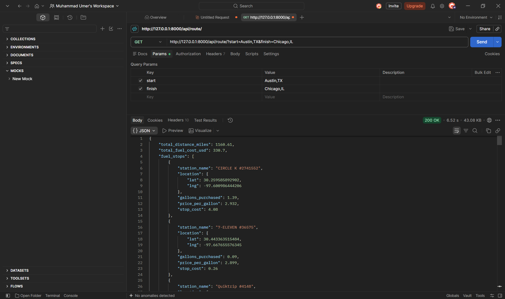

# ⛽ Optimal Fuel Routing API

A high-performance Django REST API that calculates the absolute mathematically optimal locations to fuel up along any route in the USA.

---

## 🚀 Key Features

* **Instant Coordinates & Addresses**: Pass exact `lat,lng` coordinates or simply type city names (e.g., `?start=Austin, TX`). The API automatically geocodes text via OpenStreetMap's Nominatim fallback.
* **Blazing Fast Spatial Indexing**: The 6,000+ gas stations are loaded into RAM on startup and indexed using a Scikit-Learn `BallTree`. This allows the API to perform complex spatial queries in milliseconds instead of iterating over a CSV file on every request.
* **Mathematically Proven Optimization**: The API uses a custom Greedy Algorithm that calculates the lowest possible cost across the entire route. Its logic has been mathematically proven against exact Linear Programming benchmarks (calculating optimal decisions in <0.10 ms).
* **Strict Constraint Enforcement**: Explicitly adheres to the 500-mile max range. If a route spans an impossible desert stretch with no stations in the dataset, it safely rejects it instead of returning an invalid route.
* **Single Network Call**: Makes exactly 1 call to the OSRM Routing API; all heavy lifting is done locally on the server.

---

## 🛠️ Tech Stack

* **Backend Framework**: Django 4.2+ & Django REST Framework
* **Routing Engine**: Open Source Routing Machine (OSRM)
* **Spatial Math & Optimization**: `numpy`, `pandas`, `scikit-learn` (`BallTree`)
* **Geometry**: `polyline`

---

## 📡 API Usage

### Endpoint
`GET /api/route/?start=<location>&finish=<location>`

### Example 1 (Coordinates)
`GET /api/route/?start=30.2672,-97.7431&finish=41.8781,-87.6298`

### Example 2 (City Names)
`GET /api/route/?start=Miami, FL&finish=Seattle, WA`

---

## 📸 Postman Demo



---

## ⚙️ How to Run Locally

### Method 1: Standard (Mac/Linux/Windows)

1. **Install Dependencies**
   ```bash
   pip install django djangorestframework requests pandas numpy scikit-learn polyline
   ```

2. **Start the Server**
   ```bash
   python manage.py runserver
   ```
   *(Note: On startup, the API will parse the CSV and build the in-memory BallTree.)*

3. **Test it!**
   Navigate to: `http://127.0.0.1:8000/api/route/?start=Austin,TX&finish=Chicago,IL`

### Method 2: Windows Quick Start (Recommended)

If you are on Windows, you can use the provided batch files for a 1-click setup:
1. Double-click `setup.bat` (This creates a virtual environment and installs everything).
2. Double-click `run_server.bat` (This starts the API).
3. **Test it!** Navigate to: `http://127.0.0.1:8000/api/route/?start=Austin,TX&finish=Chicago,IL`